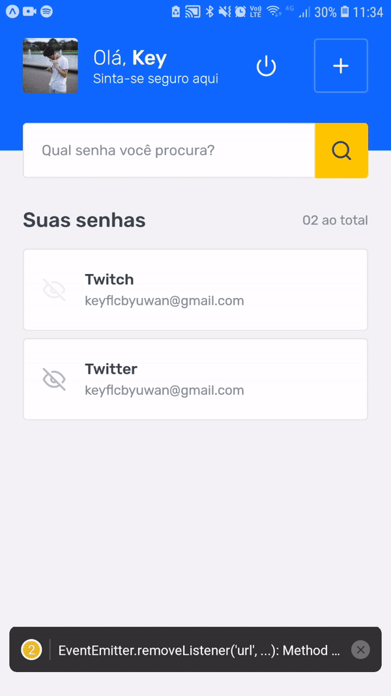

    
    <h1>SavePass</h1>

This project was a challenge from the React Native Ignite bootcamp from Rocketseat.

## 📸 Overview

    
    

## 💻 Project

The project is an app that allows users to save their services accounts passwords.

I included funcitonalities that goes beyond what the challenge was requesting, such as:

- Authentication (with Google);
- Link users accounts to their passwords saved in storage, so different users will have their passwords saved in different storages.
- Used Context API to share the user's information throught the app;

**⚒️ Features**

- Google authentication;
- Register a service account password;
- Persist data using Async Storage;
- Deal with the form with uncontrolled components using React Hook Form;
- Option to hide/show the passwords;

## ✨ Technologies

#### - React Native

#### - TypeScript

#### - Expo

#### - Async Storage

#### - React Navigation

#### - React Hook Form

#### - Styled Components
